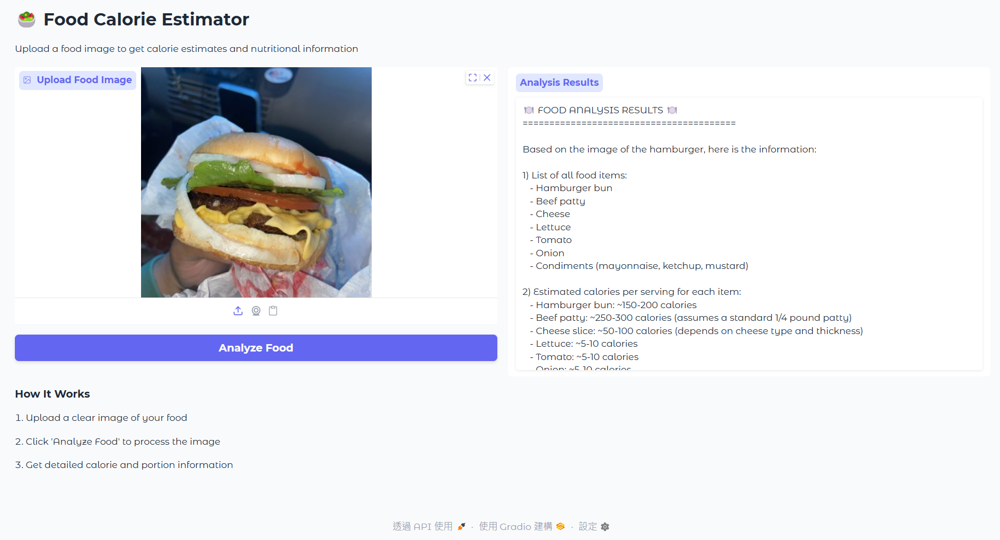
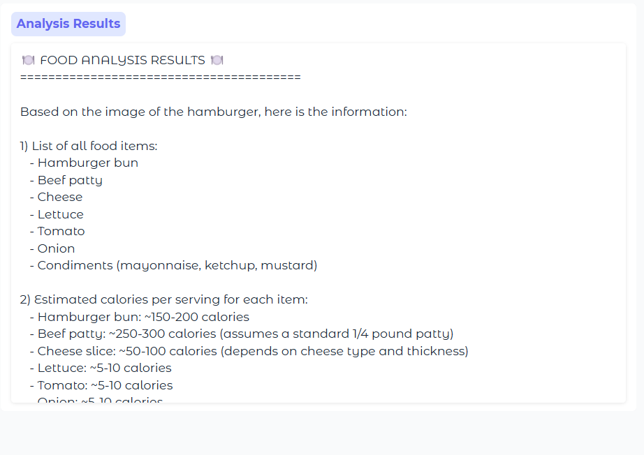
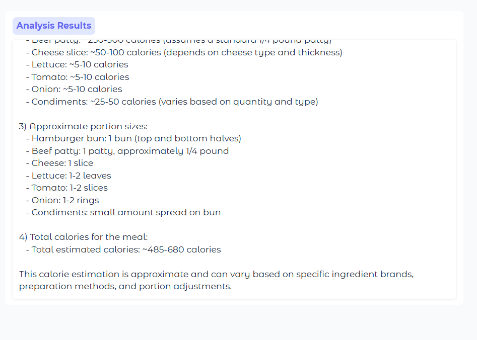

# Food Calorie Estimator

## Setup Instruction

**Open Google Colab, Upload this ipynb file.**  
**Run the program, and open the URL:  Running on public URL: https://xxxx.gradio.live**  

---

## Features

### 1. UPLOAD FOOD IMAGE
Follow instructions on the user interface, and upload a food image.

---

### 2. Analysis Result

